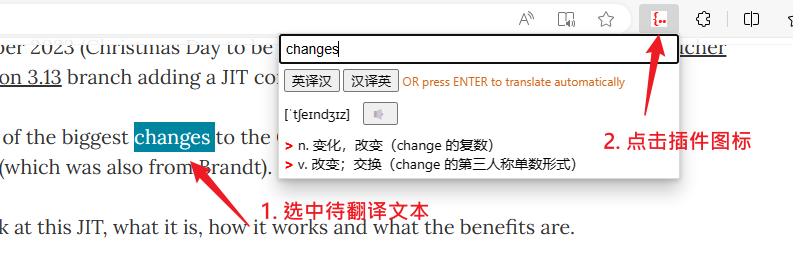

### 前言

只是偶尔遇到生词了查一下，但是很多的翻译插件都会在你选中之后旁边出现一个翻译按钮，对于我这个强迫症来说还是有点难受，并且很多插件支持语言太多，国人大多数时候还是英汉多一点，这就导致这些插件每次查询的时候都要在很多语言上翻找，真的很麻烦。

体验最好的还是沙拉词典（Saladict），但它有一个致命的问题是的我不得不放弃它，由于它的弹窗机制，当在github上浏览ipynb的文件时，任何的双击或者选中操作都会使得整个页面变为空白

本项目使用 [有道翻译api](https://fanyi.youdao.com/openapi/)

### 优势：

1. 选中文字后点击插件图标自动翻译
2. 支持手动输入后翻译
3. 简单的自动翻译类型选择（当输入内容以英语开头时，按enter后自动以英译汉的方式翻译）

### 安装

使用该插件首选需要打开浏览器开发者模式

首先将项目clone下来放到一个不会轻易删除的目录（我就放到了 `C:\Users\{用户名}\AppData\Local\` 目录下，因为插件的使用会基于该文件夹），去 [有道翻译官网](https://ai.youdao.com/console/#/app-overview) 申请一个应用，并在 `SwiftTranslate.js` 文件中替换掉应用id和密钥，然后按下图流程安装即可（给我自己说的：用之前也去看看这个文件有个有个地方需要改动一下）

1. 进入浏览器的插件管理或者在地址栏输入 `edge://extensions/`，在插件管理页面中打开开发者模式

2. 然后在加载解压包选择clone下来的文件夹

3. 最后按上面图示让图标在浏览器的工具栏中显示

### 使用

- 选中任意页面待翻译的文本后，点击图标即可
- 直接点击图标输入待翻译的文本后按回车或点击翻译按钮即可

### 常见错误码

如果调用api出错会显示错误码，这个错误码可以在 [有道翻译api文档](https://fanyi.youdao.com/openapi/) 中找到，选择左边的 API文档 -> 文本翻译 -> 右边目录中选择错误代码列表

这里列出常见的两个：

- 101	缺少必填的参数,首先确保必填参数齐全，然后确认参数书写是否正确。
- 113	翻译文本不能为空
- 202	签名检验失败,如果确认应用ID和应用密钥的正确性，仍返回202，一般是编码问题。请确保翻译文本 q 为UTF-8编码.
- 401	账户已经欠费，请进行账户充值